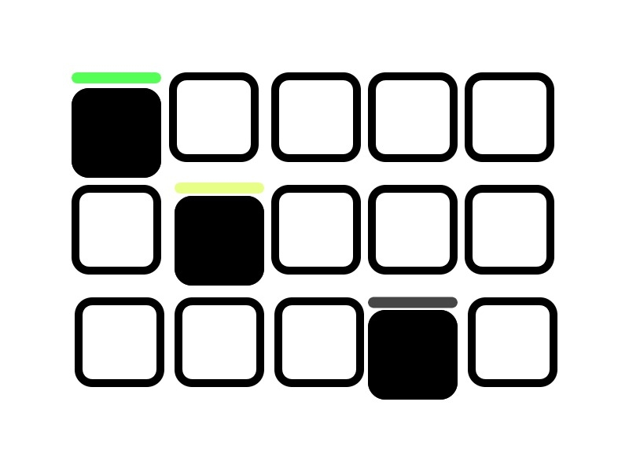

<p align="center">
    
</p>
<h4 align="center">Woodle 🎛 + NextJS <span>
</span></h4>

<p align="center">
    <a href="https://devpost.com/software/woodle-with-bootstrap"></a>
     
</p>

<p align="center">
  <a href="#Introduction">About</a> •
  <a href="#initialization">Project Setup</a> •
  <a href="#contributing">Contributing</a> •
  <a href="#license">License</a>
</p>

## Introduction



This project was an idea that originated from MLH global hack week challenges. There was a challenge of creating a woodle clone in 15 minutes but I decided to bring a spin on it, what about creating a woodle clone with nextjs and React.
I looked for a woodle clone that was built with react and make migrations to nextjs. I used this project as my starting point [monsieurpunto/wordle-clone-reactjs](https://github.com/monsieurpunto/wordle-clone-reactjs.git) and made migrations to nextjs

## What it does
It's the normal woodle you know and love, but beefed up a lot.

## How we built it
Initially, I thought of being a purist but this presented an opportunity for me to learn more about react and nextjs. It gave me the opportunity to know the difference btwn pure react and nextjs.
## What we learned
I leant bootstrap and how amazing javascript world is.

## Project Setup
### Project Initialization

This Project is built using  Nextjs, React and Nodejs

To setup the project, have to clone this repository to your local drive.
To setup the project, have to clone this repository to your local drive.

```shell
git clone https://github.com/WalterBanda/Woodle-Clone---NextJS
```

To setup the nodejs project after cloning run the following commands 
```shell
yarn install .
# For Npm Users
npm install
```

### Running & Testing 🧪

To run the application and test it. Launch your terminal and run the following commands.

```shell
yarn dev
# For Npm Users
npm run dev
```

# Contributing
You are free to Contribute to this project only if you follow Github Community guidelines.

# License
This Project is under the MIT license
